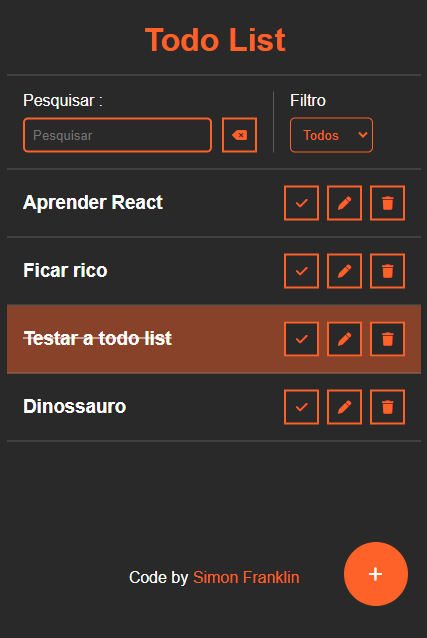
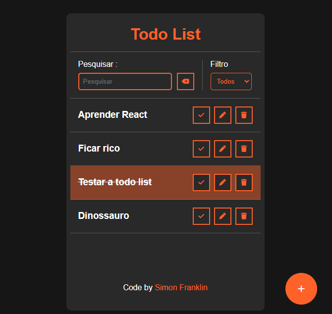

# Todo List

Isso é uma todo list feita para fixar alguns conteúdos aprendidos recentemente

## Tabela de conteúdos

- [Visão Geral](#visão-geral)
  - [Funcionalidades](#funcionalidades)
  - [Screenshot](#screenshot)
  - [Links](#links)
- [Meu processo](#meu-processo)
  - [Feito com](#feito-com)
- [Autor](#autor)

## Visão Geral

### Funcionalidades

O usuário deve ser capaz de:

- Ver o layout otimizado da página dependendo do tamanho da tela
- ver animações de hover nos elementos interativos da página
- Adicionar, editar e remover tarefas na todo list
- Carregar tarefas salvas anteriormente na página
- Buscar uma tarefa salva anteriormente no input de busca
- Filtrar as tarefas que vão aparecer utilizando o filtro

### Screenshot

### Links

- Live Site URL: [Todo List](#https://simonfranklin1.github.io/Todo-List/)

## Meu processo

### Feito com

- HTML5 Semântico
- CSS 
- Flexbox
- Feito em Mobile-First

- ### Autor
- - Github - [@simonfranklin1](#https://github.com/simonfranklin1)
